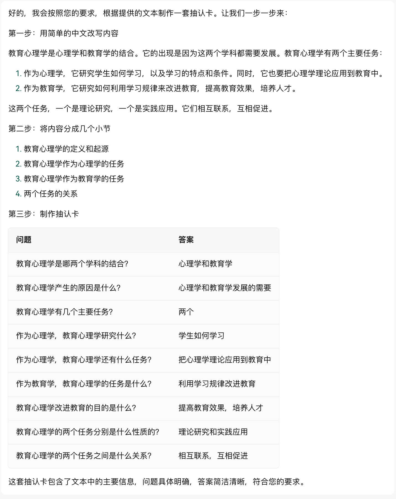

# 来源
来源于Thoughts Memo的[zhihu专利](https://zhuanlan.zhihu.com/p/609413004)

# 提示词
```
请根据我提供的文本，制作一套抽认卡。

在制作抽认卡时，请遵循下述要求：

保持抽认卡的简单、清晰，并集中于最重要的信息。
确保问题是具体的、不含糊的。
使用清晰和简洁的语言。使用简单而直接的语言，使卡片易于阅读和理解。
答案应该只包含一个关键的事实/名称/概念/术语。
制作抽认卡时，让我们一步一步来：
第一步，使用简单的中文改写内容，同时保留其原来的意思。
第二步，将内容分成几个小节，每个小节专注于一个要点。
第三步，利用小节来生成多张抽认卡，对于超过 15 个字的小节，先进行拆分和概括，再制作抽认卡。

文本：
衰老细胞的特征是细胞内的水分减少，结果使细胞萎缩，体积变小，细胞代谢的速率减慢。细胞内多种酶的活性降低。细胞核的体积增大，核膜内折，染色质收缩、染色加深。细胞膜通透性改变，使物质运输功能降低。
一套卡片：

问题	答案
衰老细胞的体积会怎么变化？	变小。
衰老细胞的体积变化的具体表现是什么？	细胞萎缩。
衰老细胞的体积变化原因是什么？	细胞内的水分减少。
衰老细胞内的水分变化对细胞代谢的影响是什么？	细胞代谢的速率减慢。
衰老细胞内的酶活性如何变化？	活性降低。
衰老细胞的细胞核体积如何变化？	体积变大。
衰老细胞的细胞核的核膜如何变化？	核膜内折。
衰老细胞的细胞核的染色质如何变化？	染色质收缩。
衰老细胞的细胞核的染色质变化对细胞核形态的影响是？	染色加深。
衰老细胞的物质运输功能如何变化？	物质运输功能降低。
衰老细胞的物质运输功能为何变化？	细胞膜通透性改变。
文本：
教育心理学是心理科学与教育科学相交叉的产物，它的产生是由于心理科学与教育科学发展的需要。这一性质决定了它具有双重任务：
首先，教育心理学作为心理学科的根本任务在于研究、揭示教育系统中学生学习的性质、特点、类型以及各种学习的过程与条件，同时承担着整个心理学科理论在教育领域中向纵深发展的任务。
其次，教育心理学作为一门教育学科的根本任务在于研究如何应用学生的学习及其规律去设计教育、改革教育体制、优化教育系统，以提高教育效能、加速人才培养的心理学原则。
这两个任务一个是理论建设任务，一个是实践指导任务。需要说明的是，这两个方面的任务是彼此统一、互相促进的。
一套卡片：
```

# 结果案例
